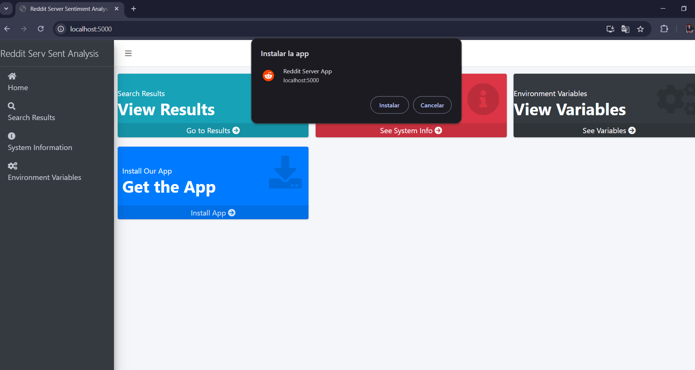
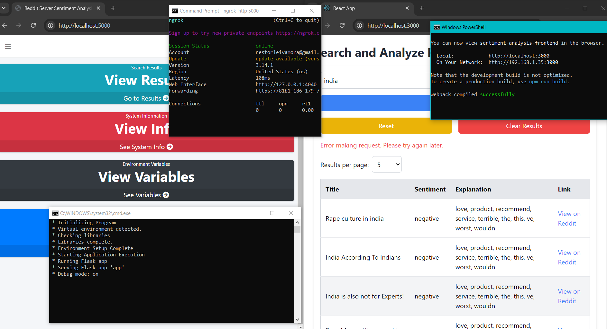

# Reddit Sentiment Analysis

This project performs sentiment analysis on Reddit posts using a machine learning model. It comprises a backend developed with Flask and a frontend developed with React.

## About
The Reddit Sentiment Analysis project is a comprehensive application designed to perform sentiment analysis on Reddit posts. This application leverages machine learning to classify the sentiment of text data extracted from Reddit, providing valuable insights into user opinions and discussions.

## Overview
This project is divided into two main components:
### 1. Backend: 
Developed using Flask, the backend handles data processing, model inference, and API interactions. It utilizes a machine learning model to analyze the sentiment of Reddit posts based on their textual content. The backend integrates with Reddit’s API to fetch posts and manage sentiment analysis requests.

### 2. Frontend:
Built with React, the frontend offers an intuitive user interface that allows users to submit Reddit posts for sentiment analysis and view the results. It provides a seamless experience for interacting with the sentiment analysis service, displaying the analyzed results in a user-friendly manner.

## Key Features
- Sentiment Analysis: Analyzes and classifies Reddit posts as positive, negative, or neutral.
- User-Friendly Interface: Allows users to easily submit posts and view analysis results.
- Integration with Reddit API: Fetches and processes posts from Reddit for analysis.
- Error Handling: Provides informative feedback to users in case of issues or errors.

## Project review 
## - Features:

### a. Functionality:

- Sentiment Analysis: Evaluates the sentiment of Reddit posts and provides a classification. 
- User Interface: Allows users to submit posts and view analysis results. 
- Error Handling: Provides feedback to users on errors or successful operations.

### b. Setup:

#### Clone the Repository:

        git clone https://github.com/netto14cr/reddit_sentiment_analysis.git

#### c. Environment Variables:
**Backend:** 

Create a .env file in the sentiment_analysis_backend directory with the following configuration:

     REDDIT_CLIENT_ID=your__redddit_client
     REDDIT_CLIENT_SECRET=your_reddit_secret
     REDDIT_USER_AGENT=your_project_name/1.0 by /u/your_user_name
     URL=your_host
     PORT=5000
     PROTOCOL=http
     FLASK_ENV=True
     CORS_ORIGINS=http://localhost:3000, https:://your_site_frontend_app.com

**Frontend:** 

Create a .env file in the sentiment_analysis_frontend directory with the following configuration:
     
     NGROK_AUTH_TOKEN=your_auth_token
     REACT_APP_NGROK_URL=https://ngrok_url.app

#### d.Install Dependencies:
**Backend:**
     
     cd sentiment_analysis_backend
     app_launcher\run_app.bat

**Frontend:**
     
     cd sentiment_analysis_frontend
     start-frontend.bat

## - Usage:

### a. Home Page:

- Access the user interface at http://localhost:3000 to interact with the application.

### b. Sentiment Analysis:

- Submit posts for analysis and view the results in the user interface.

## 3. Technologies Used:
- Backend: Python, Flask
- Frontend: React
- Sentiment Analysis Model: scikit-learn
- Reddit Services: praw

## 4. Screenshots:

### Image #01

### Image #02

### Image #03

### Image #04

### Image #05

### Image #06

### Image #07

### Image #08

### Image #09

### Image #10

### Image #11

### Image #12

### Image #13

### Image #14

### Image #15

### Image #16

## 5. LICENSE:
This project is licensed under the MIT License for educational use only. For professional or commercial use, please obtain proper licensing. See the LICENSE file for more details.
